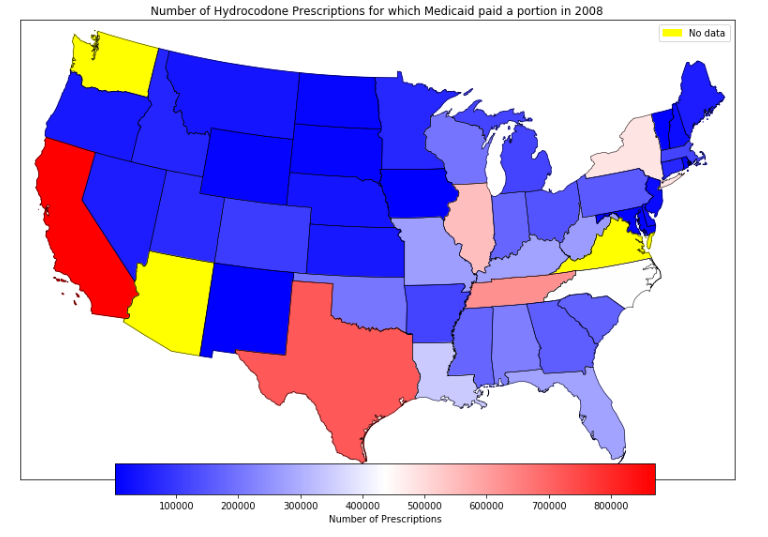
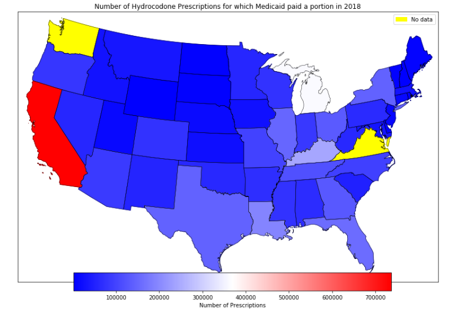

# State-Drug-Utilization-Data

Publication of these drug utilization data sets have been available since the start of the Medicaid Drug Rebate Program, where states report drug utilization for covered outpatient drugs paid for by state Medicaid agencies.

More information about the data set and an explanation of the data field descriptions can be found in this FAQ [here.](https://www.medicaid.gov/medicaid/prescription-drugs/state-drug-utilization-data/state-drug-utilization-data-faq/index.html)

## Motivation

Creating visually rich images of tabular data can provide insights that are often difficult to see in tabular format.

  
  

The 2 examples above compare the number of prescriptions Medicaid paid for in full or in portion between 2008 and 2018. The visualizations how a decreasing trend in the number of hydrocodone prescriptions for which Medicaid paid a portion in 2018 compared to 2008. This is in line with most states adopting tougher prescription size limits as well as some states requiring prior authorizations before approval. Hydrocodone was also re-classified to a Schedule II drug further restricting its prescribing requirements.

  

The example above displays the number of hydrocodone units that were reimbursed by Medicare in 2017. The size of the blue circles are representative of the number of units (based on Unit Type) reimbursed by Medicaid sorted by each state.
